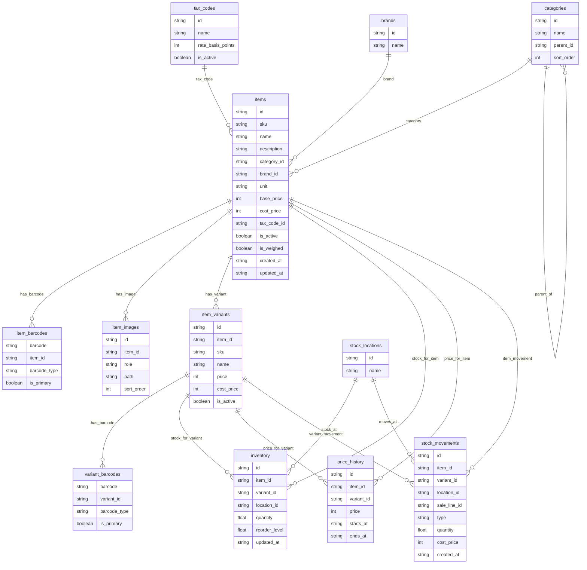
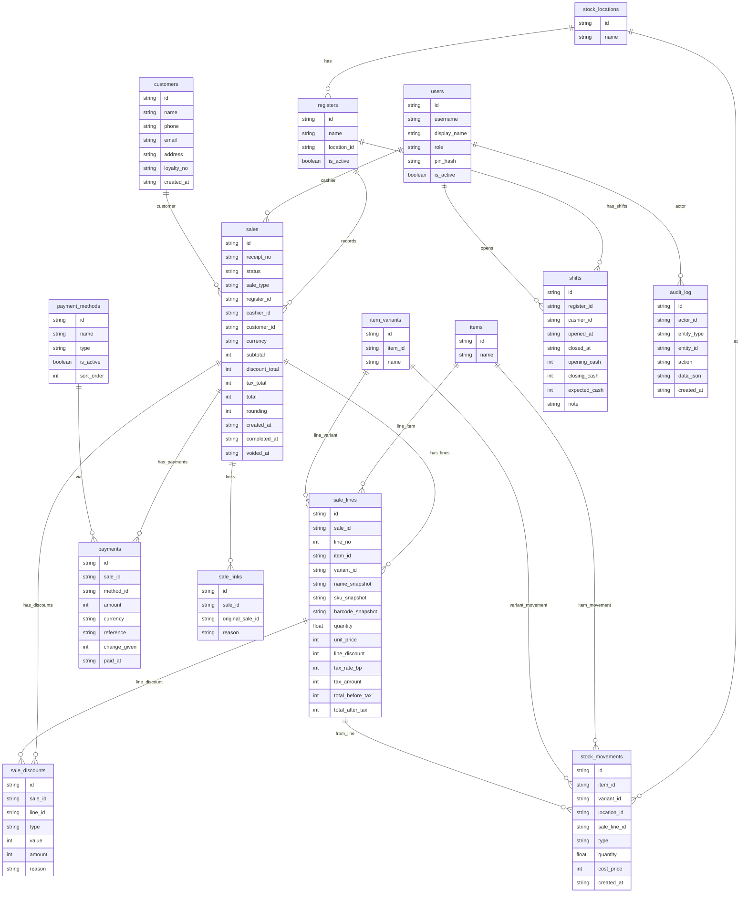
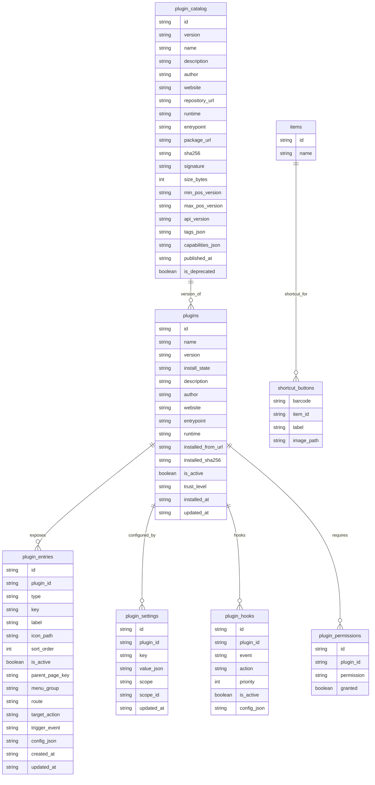

# UniversalTill Data Model (SQLite)

This document describes the physical relational schema implemented by `001_init.sql`
and subsequent migrations.

- DB engine: SQLite
- Migrations: `internal/db/migrations/*.sql`
- Foreign keys: `PRAGMA foreign_keys = ON`

## Money & quantities

- All monetary values are stored as INTEGER minor units (pence).
- Quantities:
  - `REAL` is used where items can be weighed (`unit = 'kg'` and `is_weighed = 1`).
  - Otherwise they represent whole units.

## Table groups

### 1. Lookup & configuration

- `schema_migrations`
- `settings`
- `tax_codes`
- `categories`
- `brands`
- `stock_locations`

(then briefly describe each, you can copy from the constitution section above)

### 2. Catalog

- `items`
- `item_barcodes`
- `item_images`
- `item_variants`
- `variant_barcodes`

### 3. Inventory & pricing

- `inventory`
- `price_history`
- `stock_movements`

### 4. Sales & payments

- `sales`
- `sale_lines`
- `sale_discounts`
- `payments`
- `sale_links`

### 5. Shifts & audit

- `shifts`
- `audit_log`

### 6. Parties & tills

- `customers`
- `users`
- `registers`

### 7. Plugins & shortcuts

- `plugin_catalog`
- `plugins`
- `plugin_entries`
- `plugin_settings`
- `plugin_hooks`
- `plugin_permissions`
- `shortcut_buttons`

## ER Diagram

# 1️⃣ Core POS – High-level Overview

```mermaid
erDiagram

    items {}
    item_variants {}
    item_barcodes {}
    item_images {}
    variant_barcodes {}
    tax_codes {}
    categories {}
    brands {}
    stock_locations {}
    inventory {}
    price_history {}

    customers {}
    users {}
    registers {}
    payment_methods {}

    sales {}
    sale_lines {}
    payments {}
    sale_discounts {}
    sale_links {}
    shifts {}
    stock_movements {}
    audit_log {}

    plugin_catalog {}
    plugins {}
    plugin_entries {}
    plugin_settings {}
    plugin_hooks {}
    plugin_permissions {}

    shortcut_buttons {}

    %% Catalog / lookup
    categories ||--o{ categories       : "parent_of"
    categories ||--o{ items            : "category"
    brands     ||--o{ items            : "brand"
    tax_codes  ||--o{ items            : "tax_code"

    items         ||--o{ item_barcodes : "has"
    items         ||--o{ item_images   : "has"
    items         ||--o{ item_variants : "has"
    item_variants ||--o{ variant_barcodes : "has"

    %% Inventory & pricing
    stock_locations ||--o{ inventory   : "stock_at"
    items           ||--o{ inventory   : "stock_for_item"
    item_variants   ||--o{ inventory   : "stock_for_variant"
    items           ||--o{ price_history : "price_for_item"
    item_variants   ||--o{ price_history : "price_for_variant"

    %% Sales & payments
    customers ||--o{ sales             : "places"
    registers ||--o{ sales             : "records"
    users     ||--o{ sales             : "handles"

    sales     ||--o{ sale_lines        : "has_lines"
    sales     ||--o{ payments          : "has_payments"
    sales     ||--o{ sale_discounts    : "has_discounts"
    sales     ||--o{ sale_links        : "links"

    sale_lines ||--o{ sale_discounts   : "line_discounts"
    payment_methods ||--o{ payments    : "via"

    %% Shifts & stock
    registers ||--o{ shifts            : "runs"
    users     ||--o{ shifts            : "opens"

    items         ||--o{ stock_movements : "moved_as_item"
    item_variants ||--o{ stock_movements : "moved_as_variant"
    stock_locations ||--o{ stock_movements : "moves_at"
    sale_lines    ||--o{ stock_movements : "from_line"

    %% Audit
    users ||--o{ audit_log            : "acts_in"

    %% Plugins & shortcuts
    plugin_catalog ||--o{ plugins           : "versions"
    plugins        ||--o{ plugin_entries    : "exposes"
    plugins        ||--o{ plugin_settings   : "configured_by"
    plugins        ||--o{ plugin_hooks      : "hooks"
    plugins        ||--o{ plugin_permissions: "requires"

    items ||--o{ shortcut_buttons      : "shortcut_for"

```

---
# 2️⃣ Catalog & Inventory – Rich Detail

---
# 3️⃣ Sales, Cash, Customers & Audit – Rich Detail

---
# 4️⃣ Plugins & Shortcuts – Rich Detail

